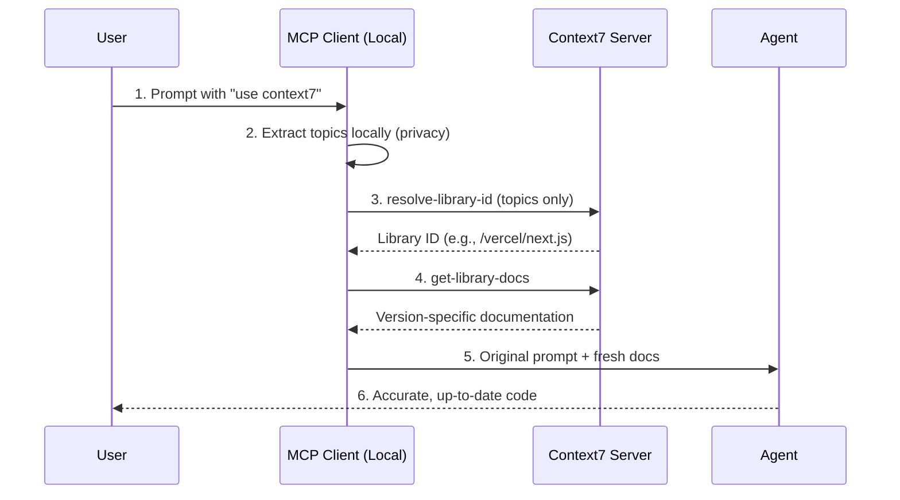

# Context7


## Overview

Context7 is an MCP server that fetches up-to-date, version-specific documentation and code examples thus expanding LLM capabilities with real-time, accurate context.

## How It Works

LLMs rely on training data that is often months or even years out of date, leading to hallucinated answers and deprecated code patterns.\
Context7 solves this by:

1. **User Prompt** - Type a query to the agent (e.g., "Create Next.js middleware") with "use context7"
2. **Local Topic Extraction** - The MCP client analyzes the prompt locally and extracts relevant topics / keywords.\
         -The actual query stays on the machine for privacy-
3. **Library Resolution** - The MCP client calls `resolve-library-id`, sending only extracted topics to Context7 servers to identify the relevant library (e.g., `/vercel/next.js`)
4. **Documentation Retrieval** - The `get-library-docs` tool fetches version-specific documentation from Context7's indexed database, filtered by topics and token limits
5. **Context Injection** - Retrieved documentation is injected into the agent's context window alongside the original prompt
6. **LLM Response** - The agent generates code using the up-to-date documentation, avoiding hallucinations and outdated APIs

Example prompt:

```text
Create a basic Next.js API route that returns JSON. use context7
```



The MCP server will fetch the latest Next.js App Router documentation and provide it to the agent, ensuring the generated code uses current APIs and patterns.

> **Privacy:** Only extracted topics are sent to Context7 servers—full prompts and code remain local.

## Key Features

- **Version-specific documentation** - Get docs tailored to the exact library versions
- **Real-time fetching** - Pulls from source rather than relying on outdated training data
- **Eliminates hallucinations** - No more APIs that don't exist or deprecated patterns
- **Auto-invocation rules** - Configure the editor to automatically trigger Context7 for relevant queries, no need to type "use context7" every time
- **Wide library support** - Supports popular frameworks with community submissions welcome
- **Private repo access** - API key unlocks access to private repositories

## Getting Started

### Remote Server (Recommended)

**Cursor / Claude Desktop:**

```json
{
  "mcpServers": {
    "context7": {
      "url": "https://mcp.context7.com/mcp"
    }
  }
}
```

**VS Code:**

```json
{
  "mcp": {
    "servers": {
      "context7": {
        "type": "http",
        "url": "https://mcp.context7.com/mcp"
      }
    }
  }
}
```

> "For other editors, refer to their MCP server configuration documentation."

### Auto-Invocation (Optional)

Add this rule to your editor settings to automatically use Context7:

> "Always use context7 when I need code generation, setup steps, or library documentation."

**Requirements:** Node.js 18.0.0 or higher

### API Key (Optional)

Context7 works without an API key with standard rate limits. For higher rate limits and private repository access, create an account at [context7.com/dashboard](https://context7.com/dashboard) to get an API key.

## Resources

- [Official Website](https://context7.com)
- [GitHub Repository](https://github.com/upstash/context7)
- [API Dashboard](https://context7.com/dashboard)
