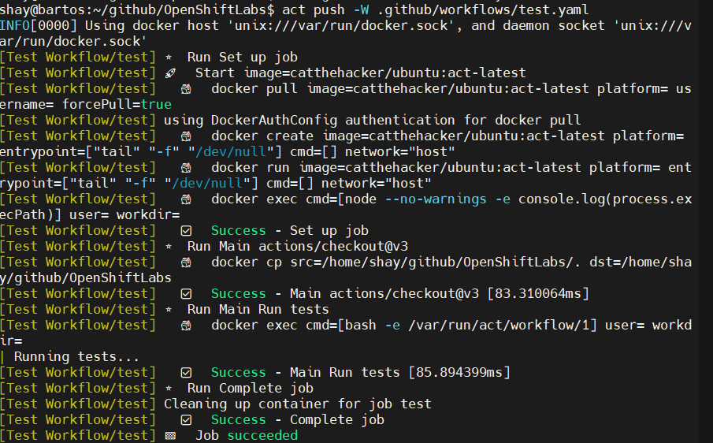

# act


## Overview

Run your GitHub Actions locally! `act` is a command-line tool that allows you to test and debug GitHub Actions workflows on your local machine using Docker. It eliminates the need to commit and push changes to GitHub just to test workflow modifications, significantly speeding up the development cycle for CI/CD pipelines.

## Key Features

- **Local Workflow Execution**: Run GitHub Actions workflows locally without pushing to GitHub
- **Docker-Based**: Uses Docker containers to simulate GitHub-hosted runners
- **Event Simulation**: Trigger workflows with custom event payloads
- **Secret Management**: Support for environment variables and secrets locally
- **Fast Iteration**: Test workflow changes instantly without waiting for cloud runners
- **Multiple Runner Images**: Supports ubuntu, macos, and windows runner environments
- **Workflow Debugging**: Step through workflow execution to identify issues quickly

## Getting Started

### Installation

```bash
# macOS
brew install act

# Linux
curl https://raw.githubusercontent.com/nektos/act/master/install.sh | sudo bash

# Windows (using Chocolatey)
choco install act-cli

# Using Go
go install github.com/nektos/act@latest
```

### Basic Usage

```bash
# List available workflows in current repository
act -l

# Run the default event (push)
act

# Run a specific workflow event
act pull_request

# Run a specific job
act -j test

# Run with custom event payload
act -e event.json

# Use a specific runner image
act -P ubuntu-latest=catthehacker/ubuntu:act-latest

# Run a specific workflow file
act -W .github/workflows/ci.yml
```

### Example: Testing a Workflow Locally

Create a simple workflow file `.github/workflows/test.yml`:

```yaml
name: Test Workflow
on: [push]
jobs:
  test:
    runs-on: ubuntu-latest
    steps:
      - uses: actions/checkout@v3
      - name: Run tests
        run: echo "Running tests..."
```

Test it locally:

```bash
# Run the push event workflow
act push

# Run a specific workflow file with a specific event
act push -W .github/workflows/test.yml

# Dry run to see what would happen
act -n

# Run with verbose output
act -v
```

#### Example Output

When running the test workflow, you'll see output similar to this:



### Working with Secrets

```bash
# Create .secrets file
echo "GITHUB_TOKEN=your_token" > .secrets

# Run workflow with secrets
act --secret-file .secrets

# Or pass secrets as environment variables
act -s GITHUB_TOKEN=your_token
```

### Using Custom Runner Images

```bash
# Use a smaller image for faster execution
act -P ubuntu-latest=node:16-buster-slim

# Configure default platforms in .actrc
cat > ~/.actrc << EOF
-P ubuntu-latest=catthehacker/ubuntu:act-latest
-P ubuntu-20.04=catthehacker/ubuntu:act-20.04
-P ubuntu-18.04=catthehacker/ubuntu:act-18.04
EOF
```

## Resources

- [Official Website](https://github.com/nektos/act)
- [Documentation](https://github.com/nektos/act#readme)
- [GitHub Repository](https://github.com/nektos/act)
- [Runner Images](https://github.com/nektos/act#runners)
